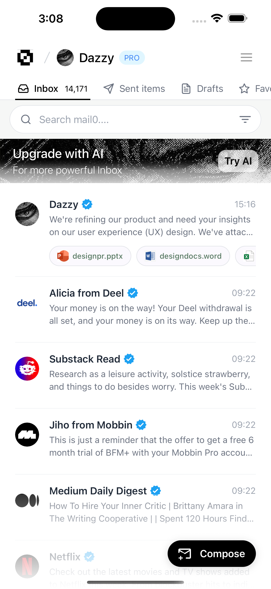
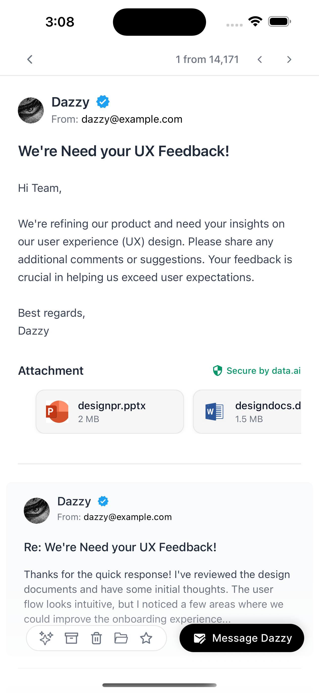

# Mail0 – Mock UI

A tiny mock of an email app UI (no backend, no real email). It has just two screens:

- Page 1 (Inbox): tabs, search, email list, compose button
- Page 2 (Email detail): full email view with attachments and quick actions

## Screenshots

  

    <h3>Home (Inbox)</h3>
    
  

  

    <h3>Email Conversation</h3>
    
  

